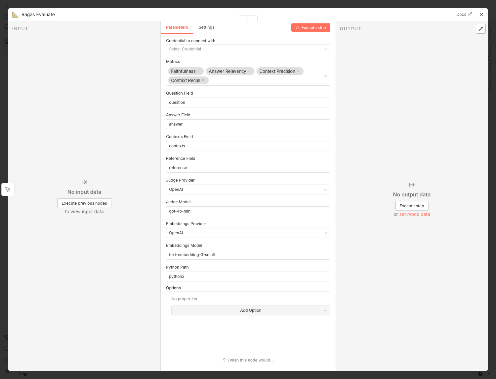

# n8n-nodes-ragas

A community [n8n](https://n8n.io/) node that brings [Ragas](https://docs.ragas.io/)
RAG evaluation into your workflows. Pipe your RAG pipeline's outputs in, get
metric scores (faithfulness, answer relevancy, context precision/recall, and
more) out — then branch on thresholds downstream.

> **Self-Hosted n8n Only**
>
> This package runs Python via `child_process` and needs Python with `ragas`
> installed on the host. It is designed for **self-hosted n8n** and cannot run on
> n8n Cloud.



## The node: Ragas Evaluate

A single node evaluates a batch of samples against a selected set of metrics in
one pass — the way Ragas is designed to work.

### Metrics (v1)

| Metric              | Needs Reference | Needs Embeddings |
|---------------------|:---------------:|:----------------:|
| Faithfulness        |        no       |        no        |
| Answer Relevancy    |        no       |       yes        |
| Context Precision   |        no       |        no        |
| Context Recall      |       yes       |        no        |
| Answer Correctness  |       yes       |        no        |
| Semantic Similarity |       yes       |       yes        |

### Providers

- **Judge model:** OpenAI, Anthropic, Google Gemini, Ollama (local / OpenAI-compatible)
- **Embeddings:** OpenAI, Google, Ollama, HuggingFace-local (sentence-transformers)

> Anthropic has no embeddings API. When you pick an Anthropic judge, pair it with
> **HuggingFace-local** embeddings (no key needed) or OpenAI embeddings.

## How it works

The node collects your input items, maps their fields to Ragas samples, and
spawns `ragas_runner.py`, passing the data as JSON on **stdin**. The Python
script configures the judge LLM + embeddings, runs `ragas.evaluate(...)`, and
returns scores as JSON on stdout. Using stdin (not command-line args) keeps large
retrieved-context payloads well within OS limits.

## Requirements

- n8n (self-hosted)
- Python 3.9+ on the host
- Python packages from `requirements.txt`:

```bash
pip install ragas langchain-openai
# plus, for the providers you use:
pip install langchain-anthropic langchain-google-genai langchain-huggingface sentence-transformers
```

## Installation

### From npm

```bash
cd ~/.n8n/custom
npm install n8n-nodes-ragas
```

Then restart n8n.

### Via the n8n UI

1. **Settings → Community Nodes → Install**
2. Enter `n8n-nodes-ragas`
3. Restart n8n

### Docker

```dockerfile
FROM n8nio/n8n:latest
USER root
RUN apk add --no-cache python3 py3-pip
RUN pip3 install ragas langchain-openai
USER node
RUN cd /home/node/.n8n/custom && npm install n8n-nodes-ragas
```

## Usage

1. Produce RAG samples upstream — each item should carry a **question**, the
   generated **answer**, the **retrieved contexts**, and (for some metrics) a
   ground-truth **reference**.
2. Add **Ragas Evaluate** and map those fields.
3. Pick your **metrics**, **judge** and **embeddings** providers/models.
4. Attach a **Ragas API** credential with your provider API key (skip it for
   fully local Ollama / HuggingFace setups).

### Input

```json
[
  {
    "question": "What is the capital of France?",
    "answer": "The capital of France is Paris.",
    "contexts": ["France is a country in Europe. Its capital is Paris."],
    "reference": "Paris"
  }
]
```

### Output

Each input item passes through with its scores appended, followed by a summary
item:

```json
[
  {
    "question": "What is the capital of France?",
    "answer": "The capital of France is Paris.",
    "faithfulness": 1.0,
    "answer_relevancy": 0.98,
    "context_precision": 1.0,
    "context_recall": 1.0
  },
  {
    "ragas_summary": {
      "faithfulness": 1.0,
      "answer_relevancy": 0.98,
      "context_precision": 1.0,
      "context_recall": 1.0
    },
    "metrics": ["faithfulness", "answer_relevancy", "context_precision", "context_recall"],
    "sample_count": 1,
    "judge_model": "openai:gpt-4o-mini",
    "embeddings_model": "openai:text-embedding-3-small"
  }
]
```

### Local / private evaluation (Ollama)

Set the **Judge Provider** to *Ollama (Local)*, the **Judge Model** to your local
model (e.g. `llama3.1`), the **Embeddings Provider** to *HuggingFace (Local)*, and
add a **Ragas API** credential with an empty API Key and a **Base URL** of
`http://localhost:11434/v1`.

## Troubleshooting

- **`ragas is not installed`** — install the requirements into the same Python
  the node calls (see **Python Path**).
- **`... require a reference for every sample`** — map a **Reference Field**, or
  drop the reference-only metrics (Context Recall, Answer Correctness, Semantic
  Similarity).
- **Wrong Python** — set the **Python Path** parameter to the interpreter that has
  `ragas` installed.

## Development

```bash
git clone https://github.com/arturovaine/n8n-nodes-ragas.git
cd n8n-nodes-ragas
npm install
npm run build      # tsc + copies icon and ragas_runner.py into dist
npm run lint

# Python helper tests (offline, no API keys needed)
pip install pytest
pytest
```

## License

MIT

## Acknowledgments

- [n8n](https://n8n.io/) — workflow automation platform
- [Ragas](https://docs.ragas.io/) — RAG evaluation framework
